# 星海知枢用户体验全面审计

审计日期：2026-08-15  
审计对象：`test-vault` 中的星海知枢主题与 `xinghai-workbench` 插件  
环境：macOS、Obsidian 1.13.4、1229 × 768 桌面视口；另做约 743px 宽桌面窄窗代理测试  
审计方式：当前轮次实机截图、Obsidian 可访问性树、源码交叉检查、自动测试与发布包一致性检查。

## 总结

桌面主视图的视觉完整度和核心数据闭环已经较成熟：星图、项目、任务、专注、日历、关联笔记与标签都读取真实数据；深浅主题可切换；二级笔记可通过 Ribbon 返回工作台；空日期不会静默创建文件；任务写回具备操作中、成功、失败回滚反馈。

但当前仍不适合正式发布。最严重的问题不是主桌面画面，而是发布包已经落后于当前源码和测试库；其次是窄屏布局、表单错误恢复和无障碍状态表达。综合评级：桌面日常使用“基本可用”，正式交付状态 `blocked`。

## 审计步骤

### 1. 从普通笔记返回工作台：健康

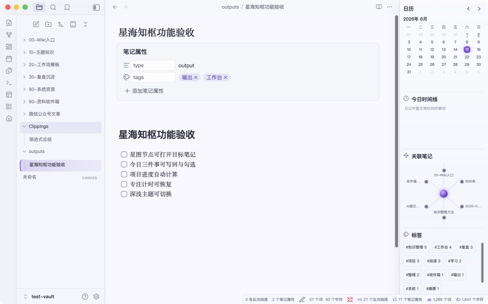

- 左侧 Ribbon 的“返回星海知枢主页”入口可被可访问性树识别，点击后能回到原工作台。
- 主视图顶栏也保留主页入口，二级内容不会形成死路。

### 2. 桌面浅色首页：基本健康

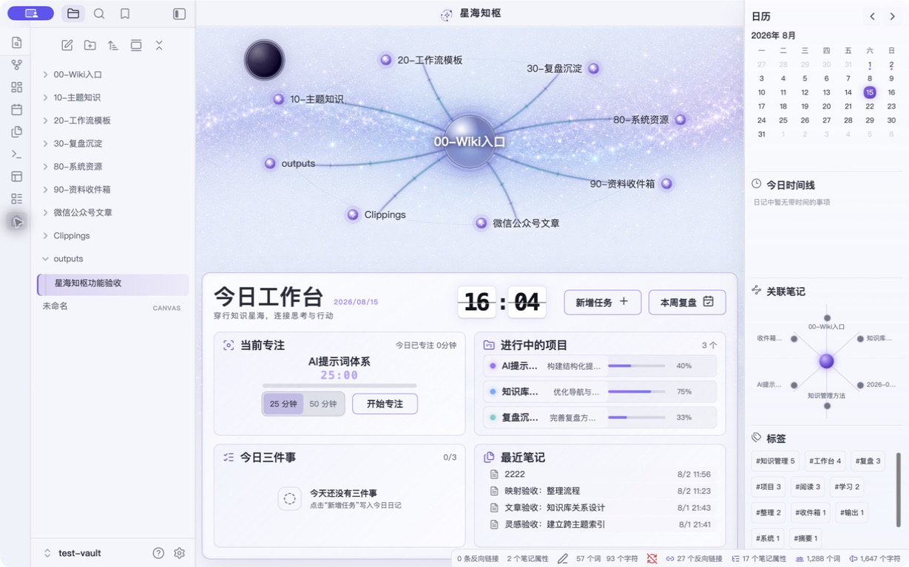

- 星图、今日工作台、项目、今日三件事、最近笔记、日历、时间线、关联笔记和标签同屏存在。
- 空数据有占位文本；主要按钮有清晰文字。
- 右栏日历日期与标签字号偏小，浅灰辅助文字存在低对比风险，需做正式对比度测量。

### 3. 新增内容：有明显问题

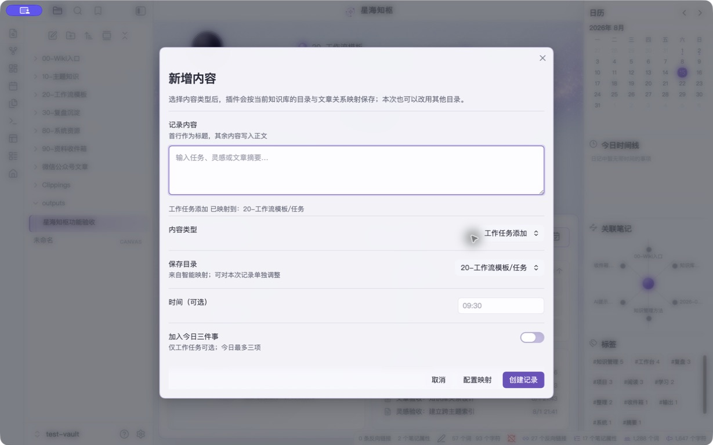

- 多行输入、内容类型、保存目录、时间和“加入今日三件事”集中在一个窗口，信息完整。
- “工作任务添加”更像动作而不是内容类型；建议改为“工作任务”。
- 空内容时“创建记录”仍呈启用状态，用户只能提交后才知道必填规则。

### 4. 空内容错误恢复：不健康

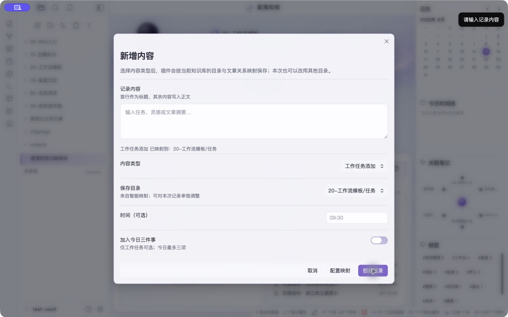

- 错误只在右上角短暂通知中出现，输入框旁没有持久说明。
- 焦点仍停留在“创建记录”按钮，没有回到错误字段；键盘和屏幕阅读器用户恢复成本高。
- 应在内容为空时禁用主按钮，或提交后设置字段错误文本、`aria-invalid`、`aria-describedby` 并聚焦输入框。

### 5. 空日期确认：基本健康

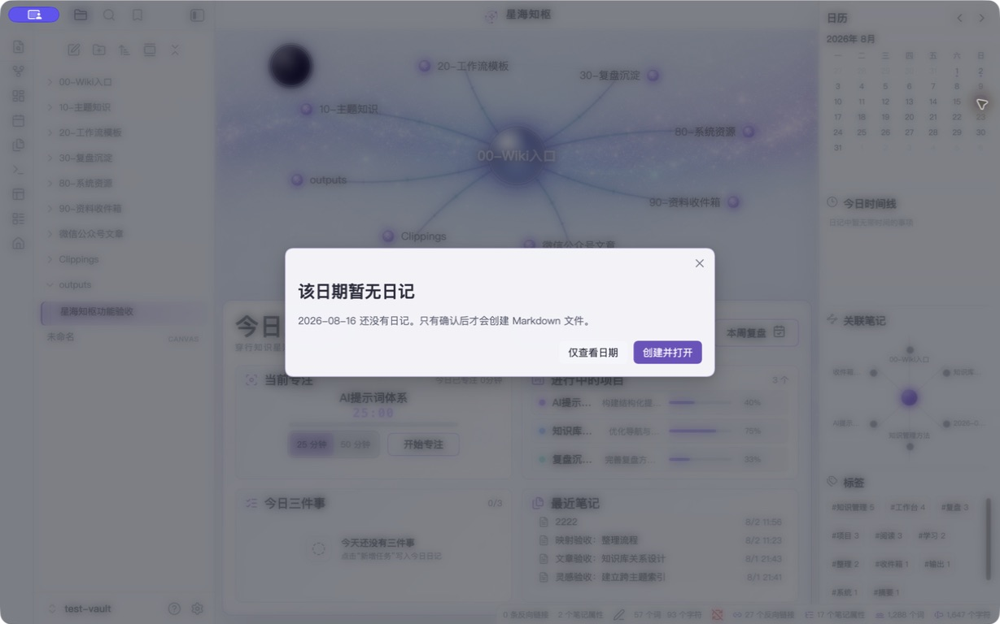

- 明确说明“只有确认后才会创建 Markdown 文件”，有效避免误写入。
- 次按钮“仅查看日期”实际只关闭窗口，并没有提供日期详情；文案应改为“取消”或真正显示该日空状态。

### 6. 专注时长选择与运行：基本健康

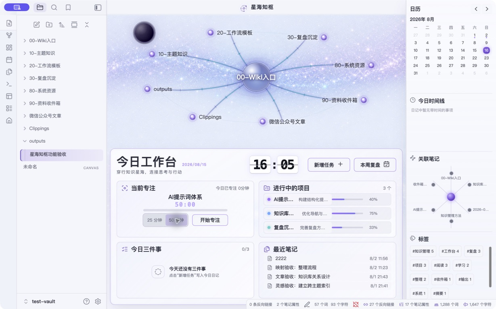

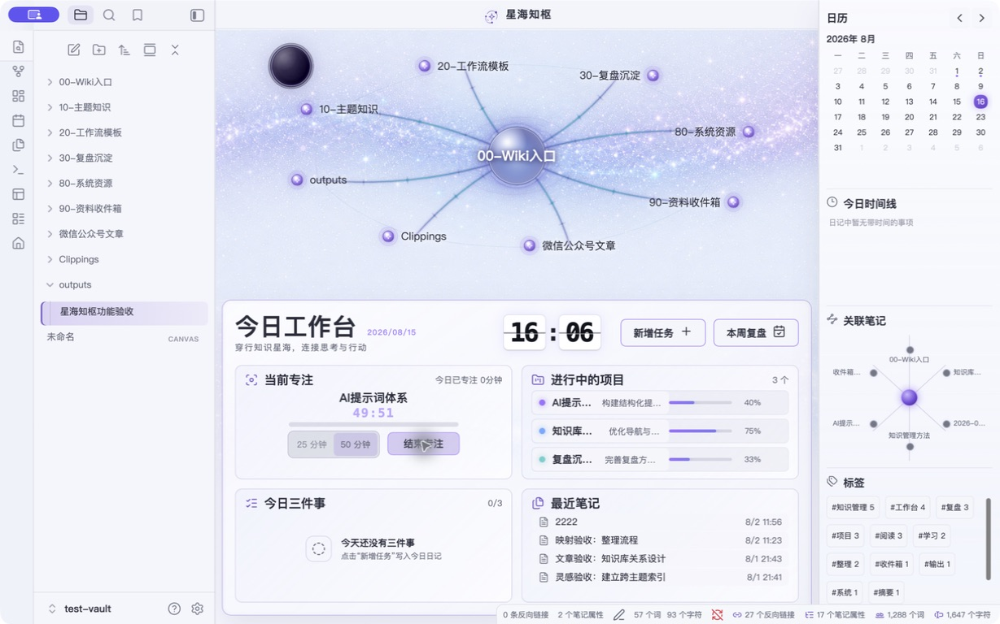

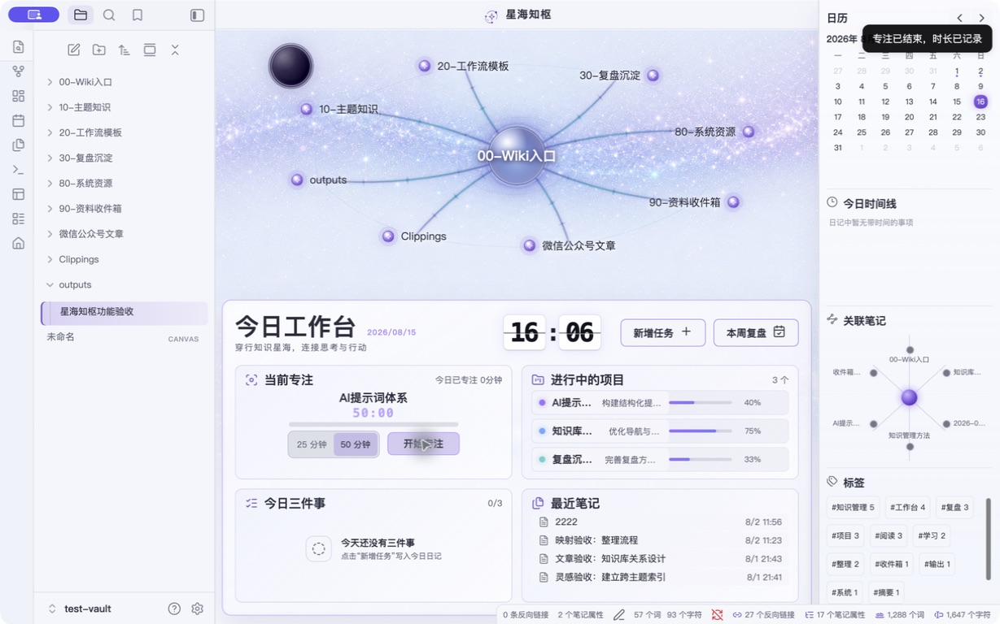

- 25/50 分钟可切换，运行时两个时长按钮禁用，主按钮改为“结束专注”，倒计时持续更新。
- 25/50 的选中状态只有视觉类名，没有 `aria-pressed`；可访问性树无法读出当前选择。
- 短于一分钟结束后提示“时长已记录”，但页面仍显示“今日已专注 0分钟”。数据实际按秒保存，显示却向下取整，用户容易误以为记录失败。
- “结束专注”没有二次确认；误触会立即结束当前会话。是否增加确认可根据目标用户习惯决定，但至少应支持撤销或明确显示本次记录时长。

### 7. 桌面深色首页：基本健康

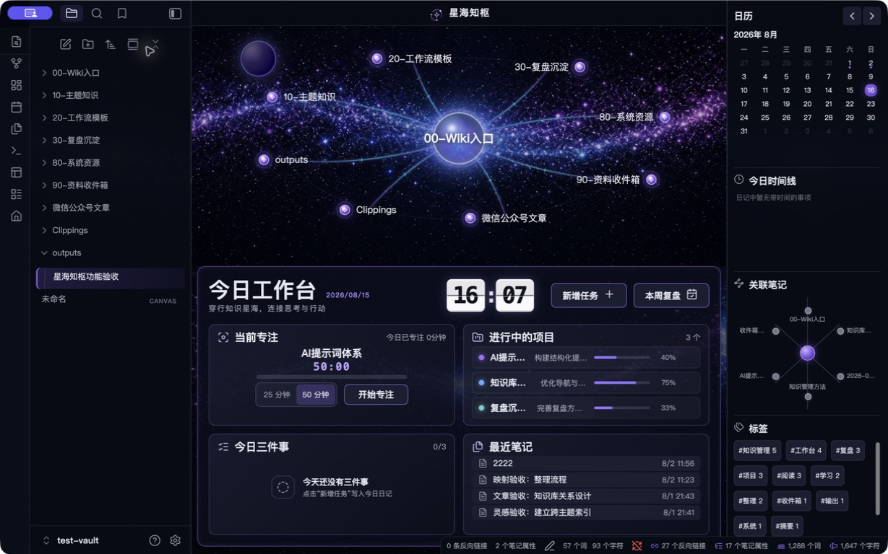

- 星海层次、主体卡片和主按钮识别清晰，主要区域没有叠压。
- 文件树、辅助文字、项目摘要、时间和日历非当前日期的对比度偏低；当前只能判定为可见风险，不能据截图宣称符合 WCAG。
- 星图节点的焦点样式主要依赖颜色与轻微缩放，且 CSS 移除了默认 `outline`，键盘焦点可能不够稳定可辨。

### 8. 窄屏工作台：不健康

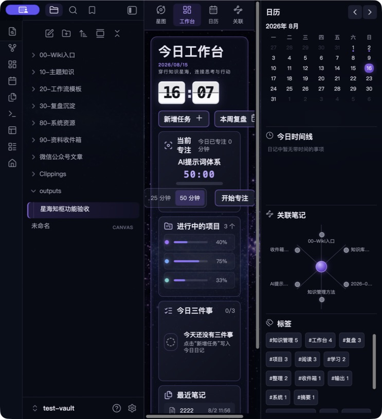

- 插件在 760px 以下切换为移动标签，但 Obsidian 左右侧栏仍保留，中央内容被压缩到约 200px。
- “本周复盘”被截断，卡片产生横向滚动，专注区文案挤压，主要操作难以使用。
- README 声称“窄屏自动切换为单列卡片”，但当前窄窗实机并不能得到可用单列体验。

### 9. 窄屏星图标签：有明显问题

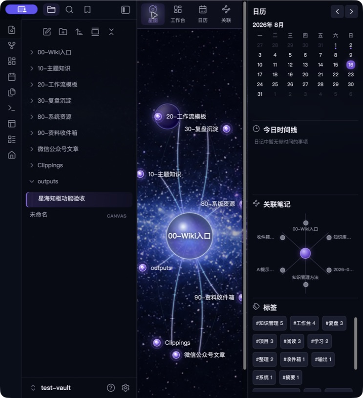

- “星图 / 工作台 / 日历 / 关联”标签可切换，基本交互成立。
- 星图右侧节点被裁切，标签当前状态只有 `.is-active`，没有 `aria-selected` 或 `aria-current`。
- 本步骤是桌面窄窗代理，不是 iOS/Android Obsidian 实机证据；真实移动端仍未验收。

## 分级问题

### P0：阻断正式发布

1. **发布安装包与当前源码严重不一致。** 当前源码相对 `release/星海知枢-工作台-v3.1.0` 的插件代码有约 `main.js +978/-92`、`styles.css +572/-65` 的差异；发布包只包含 3 个插件资产，当前源码包含 7 个，缺少星图背景和深浅暗面星球等资产。用户安装 V3.1 得到的不是本轮审计与当前测试库中的版本。

### P1：高影响

2. **窄屏布局在左右侧栏开启时不可用。** 核心操作被截断并产生横向滚动，星图节点裁切。
3. **新增内容的必填错误恢复不完整。** 主按钮提前可用、错误只用短暂通知、焦点不回字段。
4. **关键选择状态未暴露给辅助技术。** 移动标签缺少 `aria-selected/aria-current`，25/50 分钟缺少 `aria-pressed`。
5. **日历语义误导。** 所有日期均被读为“日期 + 日记”，即使当日没有日记；当前日、选中日、有日记状态也没有完整的无障碍状态表达。
6. **核心模块标题不是语义标题。** “当前专注 / 进行中的项目 / 今日三件事 / 最近笔记”使用普通 `div/span`，屏幕阅读器无法按标题导航。
7. **真实移动端仍无证据。** 当前只能证明 CSS 标签模式和桌面窄窗行为，不能证明触控、软键盘、安全区、横竖屏、工作区恢复或 Android/iOS 差异。

### P2：中影响

8. **安装与使用文档已经过期。** INSTALL 仍写“快速捕捉”，界面实际是“新增任务”；README 仍描述固定目录与可用窄屏单列，与动态目录和实机结果不一致。
9. **日历取消文案不准确。** “仅查看日期”没有真正的查看结果。
10. **专注统计的秒级记录与分钟显示不一致。** 短会话提示已记录但界面仍为 0 分钟。
11. **部分目标过小。** 1229px 紧凑规则把日历日期压到 18 × 18px，专注分段按钮最低 24–28px，低于常见触控目标建议；桌面鼠标可用，但触控板、运动障碍用户和缩放场景风险较高。
12. **深浅主题的辅助文字和焦点对比需实测。** 截图显示存在风险，但尚未进行像素对比度、200% 缩放和高对比模式验证。

## 已确认优点

- 数据不造假：任务、项目、最近笔记、日历、关系和标签来自真实 Markdown/Properties。
- 危险写入有保护：无日记日期先确认，取消不会创建文件。
- 异步任务写回设计较完整：有禁用、`aria-busy`、成功提示、失败回滚和失败文本。
- 导航闭环清楚：二级内容可通过 Ribbon 一键回主页。
- 深浅主题切换正常，主要布局在 1229 × 768 下完整。
- CSS 已处理 `prefers-reduced-motion`，装饰暗面星球使用 `aria-hidden`。
- 自动检查通过：`node --check`、67 项核心断言、包结构检查均通过；但现有包检查没有检测“发布包是否与当前源码一致”。

## 建议修复顺序

1. 先增加发布一致性门禁：构建时校验源码、测试库安装副本、解压目录和 ZIP 内文件哈希及资产清单完全一致。
2. 修复窄屏：在中央叶片宽度不足时主动提示折叠左右侧栏，或只在 Obsidian 移动端启用标签模式；消除横向滚动并逐标签验收。
3. 完成表单验证：必填状态、内联错误、错误聚焦、主按钮可用性和键盘提交。
4. 补齐无障碍语义：标签状态、分段按钮状态、日历状态、模块标题、焦点轮廓和状态通知。
5. 统一专注统计的存储与显示口径，结束后展示本次实际记录时长。
6. 更新 README/INSTALL，并在干净测试库完整走一遍首次安装与内容映射。
7. 在 iOS 与 Android Obsidian 实机完成截图、触控、软键盘、横竖屏、工作区恢复和写回测试后再解除发布阻断。

## 证据限制

- 没有修改正式 Tmac 知识库。
- 没有在干净库重置首次安装流程，首次内容映射主要依据源码检查，未作为实机通过项。
- 没有进行 VoiceOver/NVDA/TalkBack 实机朗读、WCAG 对比度测量、200% 缩放和高对比模式测试。
- 没有 iOS/Android 真机；窄屏截图仅是桌面窗口缩窄后的代理证据。
- 专注测试在测试库产生的 19 秒记录和 50 分钟默认值已恢复，主题也恢复为审计前的浅色模式。
